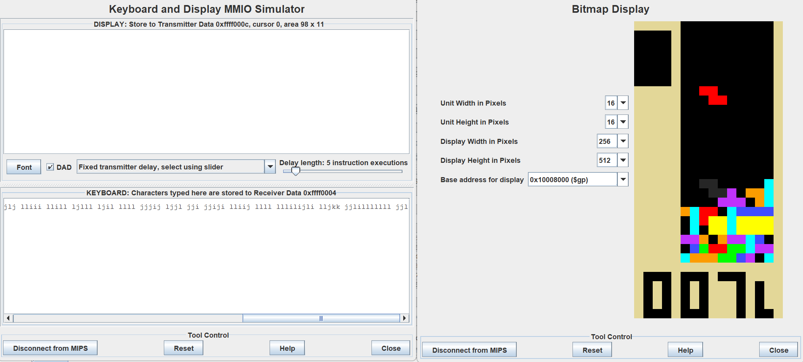
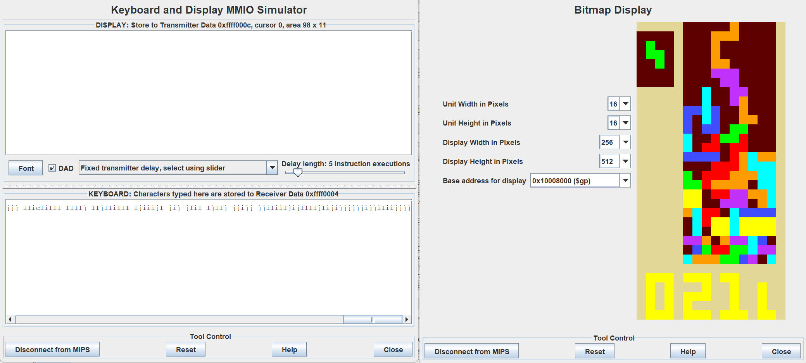

# mipstris
### A mostly complete version of tetris, built in MIPS.
This program runs a (mostly faithful) rendition of the game TETRIS in the MIPS **Bitmap Display**, controlled by the **Keyboard and Display MMIO Simulator.**

## Gameplay
This game is a verision of Tetris, although with a few functionalities removed.
In this game, blocks fall from the top of the screen in a 10x26 grid. When a block cannot move down any further, that block is **placed**. Players try to move the blocks to create **lines** - a row in the grid in which all 10 spaces are filled. Each line completed contributes to your score, which is shown underneath the grid. If a block touches the top of the screen, the game ends.

Players can move the block **left, right and down** but **cannot move the block up**. They can also rotate the block in either direction, and "**hold**" a block - save a block, which can be swapped out for another block later. Holding can only be done once before a block must be placed.

The game speeds up over time, based on the amount of lines cleared, maxing out after 22 lines are cleared. 
## Differences from actual Tetris
There were some features of Tetris that I was unable to implement. These are
- **Rotation forgiveness**
  - In the official game, rotating a block against a wall or the floor would move the block slightly to allow for the rotation. I instead disallowed such rotations.
  - Related to this, the mechanic of "**t-spins**" are also not in this version of the game
- **Score**
  - Partially because t-spins are such a large part of scoring in the originl game, the scoring system has also been simplified, just counting lines, instead of putting more score value on a 4-line clear or consecutive clears.
- **Levels**
  - In Tetris, the speed corresponds to your level, which is increased by different factors. This has also been simplified.
  

## Starting the game
1. Open the file [mipstris.asm](/mipstris.asm) in MARS or MARS+.
2. Navigate to the **Tools** section in the toolbar, and open both the **Bitmap Display** and the **Keyboard and Display MMIO Simulator.**
3. Change the settings of **Bitmap Display** to match the following:

- Unit Width in Pixels: **16**
- Unit Height in Pixels: **16**
- Display Width in Pixels: **256**
- Display Height in Pixels: **512**
- Base Address For Display: **0x10008000 ($gp)**

  *Resize as needed after settings are changed.*

4. Connect both the Bitmap Display and the Keyboard and Display MMIO Simulator to MIPS with the button in the bottom left of each window.
  
  #### Your Bitmap Display and Keyboard and Display MMIO Simulator should now look like this:

  *The window sizes do not matter, so long as the full bitmap display is visible, and the KEYBOARD input box is visible.*
  
5. Assemble and run the file using the buttons in the toolbar.
6. The game should start immediately - get ready!
## Controls
*Input Controls into the **KEYBOARD** section of the **Keyboard and Display MMIO Simulator.***
- Move current block using `j`,`k`,`l`
- Rotate the block using `i` and `z`
- Hold a block using `c`
- Slam a block using `space` 
- Quit early using `q`
## Sample Runs
#### Sample Gamestate

#### Game Over


## Pseudocode
*This is pretty complicated - a flowchart would just look like a mess! I'm going to give an overview of the important subroutines and the gameplay loop here.*

### Subroutines
- **drawblock**: draws a block at a point
   - Accesses a multidimensional array which holds every possible iteration of a block in relation to a point, then loops through the array to draw out the block.
   - Another array stores the colours for each block.
   - A Parameter can be changed to make the subroutine instead erase a specific block at a point, or draw it in grey (this is used for the indicator)
-  **drawbackground**: draws the background.
-  **checkok**: checks if the position the block is trying to move into is occupied, or a wall.
   - Using the same array as **drawblock**, this subroutine checks all squares positions and returns failure if any block overlaps with another, or a wall.
-  **clearlines**: clears completed lines, iterates score, animates the blinking animation, and then checks for a gameover
   - Scans each row to see if that row is cleared.
   - If the scanned row is cleared, then stores the Y-value of the row, as well as the colours of the blocks in the row.
   - Uses these stored values to create a blinking effect, by redrawing the stored colours and blacking out the row repeatedly
   - Then adds and redraws the score.
- **gameover**: recolours background in maroon, and the score in gold
   - scans for black squares, and replaces them with maroon or gold based on their Y-value.
- **indic**: draws the indicator
   - Scans for the lowest valid position underneath the block using **checkok**, and draws a grey block there using **drawblock** 
- **holdpiece**: swaps the held piece with the current one
   - if there is no held piece, returns a randomly generated one (This will only happen on the first hold of the game)
   - ignore the draw and generation by jumping to [ready](#ready-sets-the-starting-position-of-the-piece)
- **drawscore**: erases and draws the score
   - Draws numbers by accessing an array of numbers and another array of "segments"
   - Each number is made up of 3 "segments," which are 5 bit values that represent a "draw" or a "empty" value.

*Example:*
the number 6 looks like this
```
###
# 
###
# #
###
```
and so is represented by three segments:
```
# | # | #
# |   | 
# | # | #
# |   | #
# | # | #
```
which are then translated to `11111, 10101, 10111`, or `31, 21, 23`
an array `numberframes` holds every segment needed for the 0-9

`numberframes: {1,4,16,17,21,23,28,29,31}`

so the value of 6 in the code is `{8,4,5}`

### Main Loop (in order)

#### **newpiece**: first locks in the previous piece, runs clearlines, then generates a random piece

#### **ready**: sets the starting position of the piece
- holding a piece jumps here instead - it starts the loop again without clearing lines or generating a random piece.

#### **loop**: this is the main loop.
1. checks if the block should move down a space - it only moves every few frames. This allows the player to input more than one input before the blocks moves down a space.
    - **If the block should move:**
      - erases the block from its previous position
      - iterates the Y-value of the block
      - run [checkok](#subroutines) to see if any collision happens
      - if it collides, then jump back to [newpiece](#newpiece-first-locks-in-the-previous-piece-runs-clearlines-then-generates-a-random-piece)
      - otherwise, [draw the block](#subroutines) in the new position
    - **If the block should not move**
      - iterate the movement checker by one.
2. delays the code, so it isn't erased immediately.
3. checks for input
    - if there is input, erase the block and the indicator and jump to the corresponding input
      - the indicator is only erased here, because the block moving down should not change the indicator.
    - otherwise, jump to [loop](#loop-this-is-the-main-loop)
    - in all of the input code, run [checkok](#subroutines) before the movement goes through
      - if checkok returns a failure, then rollback the movement, and jump back to [loop](#loop)
      - otherwise, [draw the indicator and the block.](#subroutines) 

## Notes
- Don't spam inputs too fast! The game runs pretty well, but too many inputs can still overload the system and crash it.
- The game does still run faster on more powerful computers - and vice versa.
